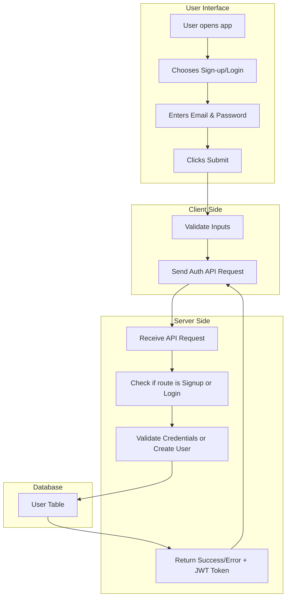
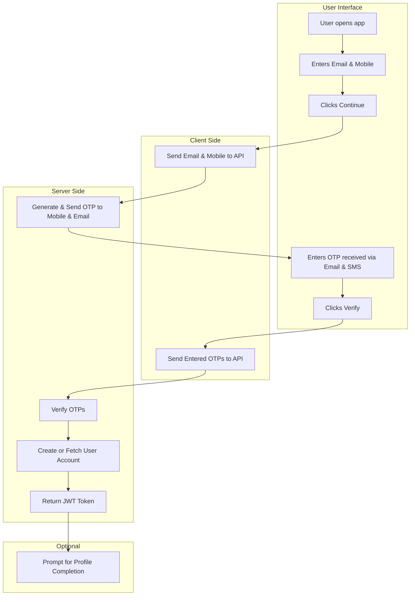

# User Onboarding Workflow – Current vs Proposed (OTP-Based)

### BFC Publications – Book Store App

---

## 1. Purpose of the Document

This document outlines the current and proposed user onboarding workflows for the BFC Publications Book Store mobile application. The goal is to improve user experience by simplifying the sign-up and login processes, reducing friction, and increasing user retention.

---

## 2. Current Workflow Overview

### Description

Users are required to create an account using their email address and a password. To log in, they must re-enter these credentials every time.

### Mermaid Diagram



### Pseudocode

```pseudo
function signUp(email, password):
    if isValidEmail(email) == false:
        return "Invalid email format"
    if isWeakPassword(password):
        return "Password too weak"
    if userExists(email):
        return "User already exists"
    hashedPassword = hashPassword(password)
    saveUserToDatabase(email, hashedPassword)
    return generateToken(email)

function login(email, password):
    user = findUserByEmail(email)
    if user == null:
        return "User not found"
    if !verifyPassword(password, user.hashedPassword):
        return "Incorrect password"
    return generateToken(user.email)
```

### Limitations

* Requires user to remember password
* Higher support cost for password recovery
* Slower onboarding and login
* Poor mobile UX

---

## 3. Proposed Workflow Overview (OTP-Based)

### Description

Users will sign up using their email and mobile number. OTPs will be sent to both for verification. No password is required. Profile completion can happen after login.

### Mermaid Diagram



### Pseudocode

```pseudo
function startSignup(email, mobile):
    if !isValidEmail(email) or !isValidMobile(mobile):
        return "Invalid input"
    otp = generateOTP()
    sendOTP(email, otp)
    sendOTP(mobile, otp)
    storeTempUser(email, mobile, otp)

function verifyOTP(email, mobile, enteredOtp):
    user = findTempUser(email, mobile)
    if user == null or user.otp != enteredOtp:
        return "Invalid OTP"
    realUser = findOrCreateUser(email, mobile)
    return generateToken(realUser)
```

### Benefits

* No password to remember
* Fast, mobile-first UX
* Optional profile completion
* Lower support needs
* Modern, user-friendly experience
---

## 4. Workflow Comparison Table

| Feature                  | Current (Email + Password) | Proposed (OTP-based)         |
| ------------------------ | -------------------------- | ---------------------------- |
| Required Inputs          | Email, Password            | Email, Mobile Number         |
| Verification             | None                       | OTP via Email & SMS          |
| Password Memory Required | Yes                        | No                           |
| Profile Completion       | Immediate                  | Optional / Later             |
| Security                 | Password stored            | OTP-based; Expirable         |
| User Experience          | Moderate                   | Seamless and Mobile-friendly |
| Support Required         | Forgot Password feature    | Minimal (OTP resend only)    |

---

## 5. Component Responsibility & Architecture

* **Client Side**: Collect email & mobile; input OTPs; manage form UI.
* **Backend API**:

  * Generate OTP
  * Verify OTP
  * Create user record or fetch existing
  * Return JWT token
* **External Services**: SMS Gateway, Email service
* **Database**: Users table, Temp OTP storage table

---

## 6. Estimated Development Timeline

| Task                            | Time Estimate         |
| ------------------------------- | --------------------- |
| UI Design & Implementation      | 2–3 days              |
| OTP Backend (Email + SMS APIs)  | 2–4 days              |
| Database adjustments            | 1 day                 |
| Token Auth & Login session mgmt | 1 day                 |
| Testing & Validation            | 2 days                |
| **Total**                       | **8–11 working days** |

---

## 7. Security Considerations

* OTP expiry (e.g., 5 minutes)
* Rate limiting per user/IP
* Brute-force protection
* Token expiration and refresh strategy
* Secure storage of user data and logs

---

## 8. Conclusion & Recommendation

The proposed OTP-based onboarding offers a faster, more user-friendly approach with minimal friction, especially suited for mobile-first users. It reduces support overhead and improves conversion. Recommended: proceed with implementation in next development cycle.

---

